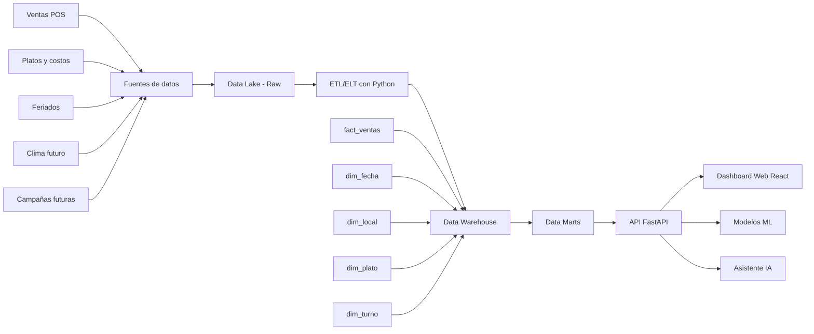

# 03 - Arquitectura de datos y aplicación

## Arquitectura conceptual



## Capas del proyecto

### Backend

Responsable de:
- generar datos
- transformar datos
- crear esquema tipo Data Warehouse
- calcular KPIs
- ejecutar análisis
- entrenar modelos
- servir endpoints JSON

### Frontend

Responsable de:
- mostrar dashboards
- construir narrativa visual
- mostrar gráficos
- permitir simulación predictiva
- integrar asistente IA

### IA / ML

Componentes:
- Regresión lineal
- K-Means
- Asistente conversacional

## Estructura recomendada

```txt
el-cazador-bi/
  backend/
    app/
      main.py
      config.py
      schemas.py
      services/
        data_generator.py
        warehouse.py
        analytics.py
        clustering.py
        regression.py
        assistant.py
        recommendations.py
      routers/
        health.py
        data.py
        summary.py
        locales.py
        eda.py
        clusters.py
        model.py
        assistant.py
        recommendations.py
      data/
        raw/
        processed/
        warehouse/
    requirements.txt
    README.md

  frontend/
    src/
      api/
        client.ts
      components/
        Layout.tsx
        Sidebar.tsx
        KpiCard.tsx
        ChartCard.tsx
        DataTable.tsx
        StoryInsight.tsx
      pages/
        Home.tsx
        Problema.tsx
        Arquitectura.tsx
        Dashboard.tsx
        Locales.tsx
        Exploratorio.tsx
        Segmentacion.tsx
        Prediccion.tsx
        AsistenteIA.tsx
        Recomendaciones.tsx
        Metodologia.tsx
        Presentacion.tsx
      App.tsx
      main.tsx
    package.json
    README.md

  docs/
    reference/
    context/
  AGENTS.md
  README.md
```
